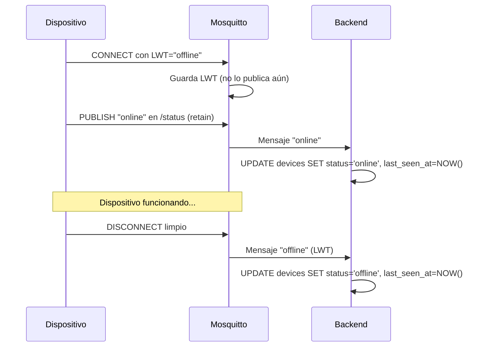
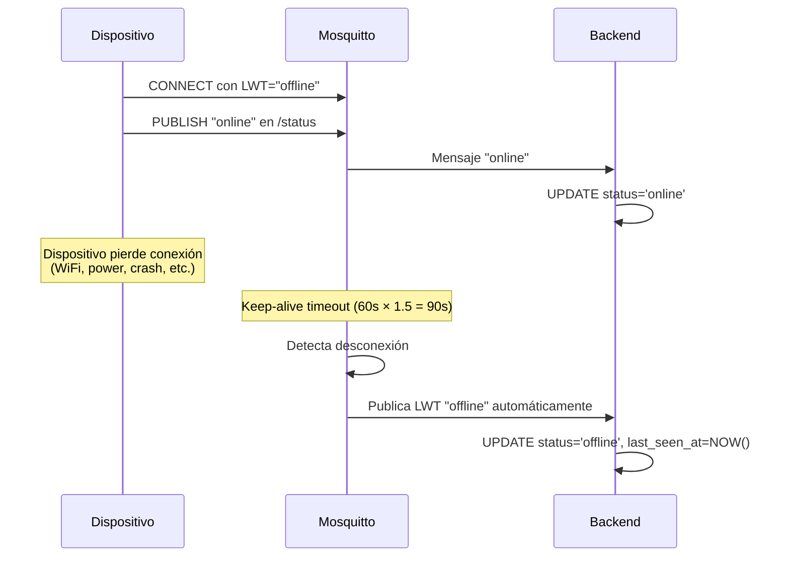

# 📡 Guía de Integración MQTT con LWT para Dispositivos NeoLogg

## 🎯 Objetivo

Esta guía explica cómo configurar tu firmware para usar **Last Will and Testament (LWT)** y mantener actualizado el estado del dispositivo en el backend de NeoLogg Cloud.

---

## 📊 Arquitectura de Comunicación

### Topics MQTT

| Topic | Dirección | Propósito | Actualiza `last_seen_at` |
|-------|-----------|-----------|--------------------------|
| `production/neologg/{SN}/status` | Dispositivo → Backend | Estado online/offline (LWT) | ✅ Sí |
| `production/neologg/{SN}/heartbeat` | Dispositivo → Backend | Ping periódico | ✅ Sí |
| `production/neologg/{SN}/data` | Dispositivo → Backend | Datos de sensores | ✅ Sí |
| `production/neologg/{SN}/license` | Dispositivo ↔ Backend | Validación de licencia | ✅ Sí |
| `production/neologg/{SN}/actions` | Backend → Dispositivo | Comandos del backend | ❌ NO |

**Importante:** El topic `/actions` es **enviado por el backend** hacia el dispositivo, por lo que **NO actualiza** `last_seen_at`.

---

## 🔧 Configuración LWT en el Firmware

### 1. Credenciales MQTT

Al aprovisionar un dispositivo, el backend devuelve:

```json
{
  "serialNumber": "NL8-2512014",
  "mqttUsername": "NL8-2512014",
  "mqttPassword": "983de5cc6aadfe6691cff6c35d742905dff06aa8ba88bfad08126c445e788594"
}
```

### 2. Configuración de Conexión

**Broker:** `mosquitto` (dentro de Docker) o la IP/dominio de tu servidor  
**Puerto:** `1883` (MQTT) o `9001` (WebSockets)  
**Keep-Alive:** `60` segundos

### 3. Configurar Last Will and Testament (LWT)

Antes de conectar, configura el LWT:

```c
// Ejemplo con librería PubSubClient (Arduino/ESP32)
const char* mqtt_server = "tu-servidor.com";
const int mqtt_port = 1883;
const char* serial_number = "NL8-2512014";
const char* mqtt_user = "NL8-2512014";
const char* mqtt_pass = "983de5cc6aadfe6691cff6c35d742905dff06aa8ba88bfad08126c445e788594";

WiFiClient espClient;
PubSubClient client(espClient);

void reconnect() {
  while (!client.connected()) {
    Serial.println("Conectando a MQTT...");
    
    // Construir el topic de status
    String statusTopic = "production/neologg/" + String(serial_number) + "/status";
    
    // Conectar con LWT configurado
    if (client.connect(
          serial_number,           // Client ID
          mqtt_user,              // Username
          mqtt_pass,              // Password
          statusTopic.c_str(),    // LWT Topic
          1,                      // LWT QoS
          true,                   // LWT Retain
          "offline"               // LWT Message
        )) {
      
      Serial.println("✓ Conectado a MQTT");
      
      // IMPORTANTE: Inmediatamente después de conectar, publicar "online"
      client.publish(statusTopic.c_str(), "online", true);
      
      // Suscribirse a topics de acciones
      String actionsTopic = "production/neologg/" + String(serial_number) + "/actions";
      client.subscribe(actionsTopic.c_str());
      
    } else {
      Serial.print("✗ Falló, rc=");
      Serial.print(client.state());
      Serial.println(" Reintentando en 5 segundos...");
      delay(5000);
    }
  }
}
```

---

## 📝 Funcionamiento del LWT

### Flujo Normal (Conexión y Desconexión Correcta)



### Flujo con Desconexión Inesperada



---

## ⏱️ Keep-Alive y Heartbeat

### Opciones de Implementación

#### Opción 1: Solo LWT (Recomendado para dispositivos con batería)
- El keep-alive MQTT maneja todo automáticamente
- Menor consumo de red y energía
- `last_seen_at` se actualiza con cualquier mensaje (data, license, etc.)

```c
void loop() {
  client.loop(); // Mantiene la conexión MQTT (envía PINGs automáticos)
  
  // Enviar datos de sensores cada 5 minutos
  if (millis() - lastDataSent > 300000) {
    sendSensorData();
    lastDataSent = millis();
  }
}
```

#### Opción 2: LWT + Heartbeat explícito (Opcional)
- Para dispositivos que necesitan reportar estado frecuentemente
- Útil para debugging

```c
void loop() {
  client.loop();
  
  // Heartbeat cada 30 segundos
  if (millis() - lastHeartbeat > 30000) {
    String heartbeatTopic = "production/neologg/" + String(serial_number) + "/heartbeat";
    client.publish(heartbeatTopic.c_str(), "ping", false); // NO retain
    lastHeartbeat = millis();
  }
  
  // Datos de sensores cada 5 minutos
  if (millis() - lastDataSent > 300000) {
    sendSensorData();
    lastDataSent = millis();
  }
}
```

---

## 🧪 Pruebas con MQTT Explorer

### 1. Conectar a Mosquitto

- **Host:** `localhost` (si estás en el servidor) o la IP del servidor
- **Port:** `1883`
- **Username:** Usa el serial number del dispositivo (ej: `NL8-2512014`)
- **Password:** El hash SHA-256 MQTT devuelto por el provisioning

### 2. Configurar LWT en MQTT Explorer

Antes de conectar, en la pestaña "Advanced":

```
Last Will Topic: production/neologg/NL8-2512014/status
Last Will Message: offline
QoS: 1
Retain: true
```

### 3. Publicar "online" después de conectar

Después de conectar exitosamente:

```
Topic: production/neologg/NL8-2512014/status
Message: online
QoS: 1
Retain: true
```

### 4. Verificar en la Base de Datos

```sql
SELECT serial_number, status, last_seen_at 
FROM devices 
WHERE serial_number = 'NL8-2512014';
```

Deberías ver:
```
 serial_number | status | last_seen_at           
---------------|--------|------------------------
 NL8-2512014   | online | 2026-01-15 16:20:35+00
```

### 5. Probar Desconexión

En MQTT Explorer, haz clic en "Disconnect". Mosquitto publicará automáticamente el LWT (`offline`).

Verifica de nuevo en la BD:
```
 serial_number | status  | last_seen_at           
---------------|---------|------------------------
 NL8-2512014   | offline | 2026-01-15 16:22:18+00
```

---

## 📡 Actualización de `last_seen_at`

El backend actualiza `last_seen_at` SOLO con mensajes que **vienen DEL dispositivo**:

✅ **Actualiza `last_seen_at`:**
- `production/neologg/{SN}/status` (online/offline)
- `production/neologg/{SN}/heartbeat`
- `production/neologg/{SN}/data`
- `production/neologg/{SN}/license`

❌ **NO actualiza `last_seen_at`:**
- `production/neologg/{SN}/actions` (estos los envía el backend)

---

## 🛠️ Troubleshooting

### El dispositivo aparece como "offline" aunque esté conectado

**Causa:** No publicaste "online" después de conectar.

**Solución:** Inmediatamente después del CONNECT exitoso, publica:
```c
client.publish("production/neologg/NL8-2512014/status", "online", true);
```

### `last_seen_at` no se actualiza

**Causa:** El dispositivo no está enviando ningún mensaje.

**Solución:** Asegúrate de que el dispositivo publique periódicamente en:
- `/heartbeat` (cada 30-60s), o
- `/data` (cuando haya datos de sensores)

### El LWT no se publica cuando el dispositivo se desconecta

**Causa 1:** No configuraste el LWT antes del CONNECT.  
**Solución:** Configura los parámetros LWT en la llamada a `client.connect()`.

**Causa 2:** El retain flag del LWT está en `false`.  
**Solución:** Usa `retain=true` en el LWT para que persista.

---

## 📚 Recursos Adicionales

- **Mosquitto Broker:** `mosquitto:1883` (dentro de Docker)
- **ACL del dispositivo:** Solo puede publicar/suscribirse a `production/neologg/{SN}/#`
- **Configuración de Mosquitto:** `max_keepalive = 60s`, `sys_interval = 10s`

---

## 🎯 Resumen

1. ✅ Configura LWT con `topic=/status`, `message=offline`, `retain=true`
2. ✅ Conéctate con tus credenciales MQTT
3. ✅ Inmediatamente después de conectar, publica `online` en `/status`
4. ✅ Envía datos de sensores o heartbeats periódicamente
5. ✅ Al desconectarte (limpia o forzada), Mosquitto publica automáticamente `offline`

**El backend se encarga del resto** actualizando `status` y `last_seen_at` automáticamente. 🚀
